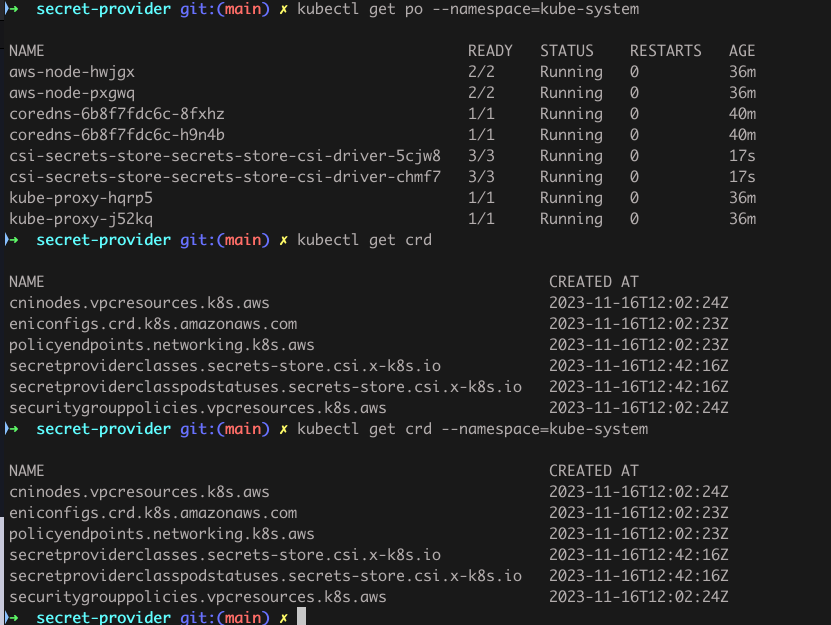

# Install Secret provider class
helm repo add secrets-store-csi-driver https://kubernetes-sigs.github.io/secrets-store-csi-driver/charts
helm install csi-secrets-store secrets-store-csi-driver/secrets-store-csi-driver --namespace kube-system
## To validate installation
kubectl get pod --namespace=kube-system

The CSI driver pods and crd shoud be running

## Install AWS Secret provider
kubectl apply -f https://raw.githubusercontent.com/aws/secrets-store-csi-driver-provider-aws/main/deployment/aws-provider-installer.yaml

https://github.com/aws/secrets-store-csi-driver-provider-aws

## SecretManager Access
1. create oidc provider for the cluster
2. create a iam role with ssm read policy (truted entiy as oidc with service account name and namespace)
3. Create service account with annotation - eks.amazonaws.com/role-arn:
 Note: Same flow as POD Identity management
## Secret provider class
https://github.com/aws/secrets-store-csi-driver-provider-aws/tree/main/examples

## Usage

In the deployment yaml, use the service account which we added in IAM Role, and use volume mount for mount secrets

